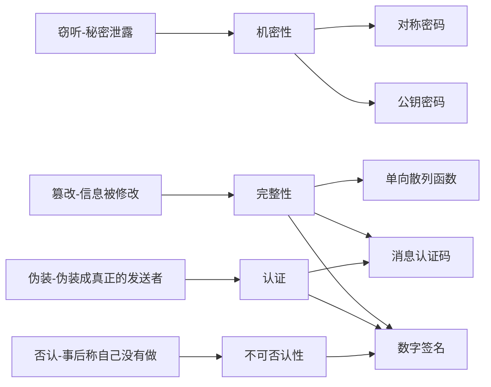

# 1 环游密码世界

发送者sender

接受者receiver

窃听者eavesdropper

加密encrypt

明文plaintext

密文ciphertext

解密decrypt

通过运用密码（cryptography）技术，保证机密性（confidentiality）

密码破译cryptanalysis，或称作**破译**，或称作**密码分析**

破译者cryptanalyst

对称密钥-symmetric cryptography：加密和解密时使用同一密钥的方式，也称作公共密钥密码（common-key cryptography）、传统密码（conventional cryptography）、私钥密码（secret-key cryptography）、共享密钥密码（shared-key cryptography）。

公钥-public key cryptography：加密和解密使用不同密钥的方式。也称为非对称密码（asymmetric cryptography）

将对称密码和公钥密码结合起来的密码方式称为混合密码系统（hybrid cryptosystem）

## 其他密码技术

### 1 单向散列函数

为了防止软件被篡改，有安全意识的软件发布者会在发布软件的同时发布该软件的散列值。散列值就是用单向散列函数（one-way hash function）。

散列值（hash）又称哈希值、密码校验和（cryptographic checksum）、指纹（fingerprint）、消息摘要（message digest）。

单向散列函数并不保证机密性，而是完整性（integrity）。使用单向散列函数，可以检测出数据是否被篡改过。

### 2 消息认证码

为了确认消息是否来自所期望的通信对象，可以使用消息认证码（message authentication code）。此机制不仅能够保证完整性，还能提供认证（authentication）机制。

### 3 数字签名

能够防止伪装、篡改和否认等威胁的技术，就是数字签名（digital signature）。数字签名就是一种将现实世界中的签名和盖章移植到数字世界中的技术，是一种重要的密码技术。数字签名是一种能够确保完整性、提供认证并防止否认的密码技术。

### 4 伪随机数生成器

伪随机数生成器（Pseudo Random Number Generator，PRNG）是一种能够模拟产生随机数列的算法。Web在进行SSL/TLS通信时，会生成一个仅用于当前通信的临时密钥（会话密钥），这个临时密钥就是基于伪随机数生成器生成的。

密码学家的工具箱说法出自，《网络信息安全的真相》（Secrets and Lines: Digital Security in a Networked World）

## 隐写术与数字水印

隐写术（steganography）不是让消息内容变得无法解读，而是能够隐藏消息本身。

密码隐藏的是内容，隐写术隐藏的是消息本身。

## 密码与信息安全常识

- 不要使用保密的密码算法
  - 密码算法的秘密迟早会公诸于世
  - 开发高强度的密码算法是非常困难的
- 使用低强度的密码比不进行任何加密更危险
  - 《密码故事》The Code Book: The History and Exploration
- 任何密码总有一天都会被破解
  - 严格来说，绝对不会被破解的密码算法是存在的，称为一次性密码本（one-time pad），但它并不是一种现实可用的算法。
  - 量子密码，可行的完美的密码技术。
- 密码只是信息安全的一部分
  - 社会工程学（social engineering）攻击。

# 2 历史上的密码

## 2.1 著名的密码

- 凯撒密码

  凯撒密码（Caesar cipher）是一种相传尤里乌斯·凯撒曾使用过的密码。通过将明文中所使用的字母表按照一定的字数“平移”来进行加密的。

  暴力破解（brute-force attack）：将所有可能的密钥全部尝试一遍，也称穷举搜索（exhaustive search）。

- 简单替换密码

  简单替换密码（simple substituion cipher）将铭文中所使用的的字母表替换为另一套字母表的密码。

  简单替换密码很难通过暴力破解来破译。一种密码能够使用的“所有密钥的集合”称为密钥空间（keyspace），所有可用密钥的总数就是密钥空间的大小。密钥空间越大，暴力破解就越困难。

  简单替换密码的密钥总数为26！=403291461126605635584000000

  相当于4兆的约100兆倍（1兆等于1万亿，即10的12次方）。

  虽然使用暴力破解能难破译简单替换密码，但使用被称为频率分析的密码破译方法，就能够破译简单替换密码。

- Enigma

  Enigma是由德国人阿瑟·谢尔比乌斯（Arthur Sherbius）发明的能够进行加密和解密操作的机器。

  Enigma是一种由键盘、齿轮、电池和灯泡所组成的机器。发送者和接受者需要使用国防军密码本的每日密码，按照册子的指示来设置Enigma。

  接线板plugboard-是一种通过改变接线方式来改变字母对应关系的部件。

  转子rotor-圆盘状的装置，其两侧的接触点之间通过电线相连。

  ​	Enigma的加密

  ①设置Enigma——每日密码

  ②加密通信密码

  ③重新设置Enigma

  ④加密消息

  ⑤拼接

  每日密码是用来加密密钥的密钥，一般称为密钥加密密钥（key encrypting key，KEK）

  ​	Enigma的解密

  ①分解

  ②设置Enigma

  ③解密通信密码

  ④重新设置Enigma

  ⑤解密消息

  ​	Enigma的弱点：

  ①加密通信密码这一步骤时，只有转子1会旋转。

  ②将通信密码连续输入两次并加密（之前无线质量差，可能会发生通信错误）。

  ③通信密码是人为选定的。

  ④必须派发国防军密码本。

  ​	Enigma的破译：

  《密码故事：人类智力的另类较量》The Code Book: The Science of Secrecy from Ancient Egypt to Quantum Cryptography

  《艾伦·图灵传：如谜的解谜者》Alan Turing: The Enigma

# 3 对称密码

## 3.1 编码

将现实世界中的东西映射为比特序列的操作称为编码（encoding）。

xor的全称是exclusive or-异或。

## 3.2 一次性密码本

一次性密码本的原理是，将明文与遗传随机的比特序列进行xor计算。即使能够解密出正确的明文，也无法进行判断。

一次性密码本是由维纳（G·S· Vernam）于1917年提出的，因此又称为维纳密码（Vernam cipher）。一次性密码本无法破译这一特性是由香农（C.E.Shannon）于1949年通过数学方法加以证明的。一次性密码本是无条件安全的（unconditionally secure），在理论上是无法破译的（theoretically unbreakable）。

一次性密码不实用：

- 密钥的配送，如果有能将密钥安全地发送出去，也能直接发送明文。（等长）
- 密钥的保存
- 密钥的重用
- 密钥的同步
- 密钥的生成

## 3.3 DES

DES-Data Encryption Standard是1977年美国联邦信息处理标准（FIPS）中所采用的的一种对称密码（FIPS 46-3）。现在DES已经能被暴力破解了。

DES的密钥长度是64比特，但由于每隔7比特会设置一个用于错误检查的比特，实质上其密钥长度是56比特。

DES是以64比特的明文（比特序列）为一个单位来进行加密的，这个64比特的单位成为分组。一般来说，以分组为单位进行处理的密码算法成为分组密码（block cipher）。DES是分组密码的一种。

### 3.3.1 DES的结构（Feistel网络）

DES的基本结构是由Horst Feistel设计的。在Feistel网络中，加密的各个步骤称为轮（round）。DES是一种16轮循环的Feistel网络。

轮函数的作用是根据“右侧”和子密钥（subkey）生成对“左侧”进行加密的比特序列。

一轮的具体计算步骤如下：

- 将输入的数据等分为左右两部分。
- 将输入的右侧直接发送到输出的右侧。
- 将输入的右侧发送到轮函数。
- 轮函数根据右侧数据和子密钥，计算出一串看上去是随机的比特序列。
- 将上一步得到的比特序列与左侧数据进行XOR运算，并将结果作为加密后的左侧。

Feistel网络的轮数可以任意增加；加密时无论使用任何函数作为轮函数都可以正确解密（即时不存在反函数）；加密和解密可以用完全相同的结构来实现。

AES最终候选算法的5个算法之中，有3个算法（MARS、RC6、Twofish）都是使用了Feistel网络。AES最终选择的Rijndael算法缺没有使用Feistel网络，Rijndael所使用的的结构成为SPN结构。

## 3.4 差分分析与线性分析

差分分析是一种针对分组密码的分析方法，由Biham和Shamir提出，其思路为，改变一部分明文并分析密文如何随之改变。

线性分析，由松井充提出，其思路为，将明文和密文的一些对应比特进行xor并计算其结果为零的概率。

差分分析和线性分析都有一个前提，假设密码破译者可以选择任何明文并得到其加密的结果，这种攻击方式为选择明文攻击（Chosen Plaintext attack, CPA）。

# 3.5 三重DES

三重DES（triple-DES）是为了增加DES的强度，将DES重复3次所得到的一种密码算法，也称为TDES，通常缩写为3DES。是加密->解密->加密的过程，由IBM公司设计出来。

- 当子密钥相同时，3DES兼容普通的DES。
- 当密钥1和密钥3使用相同的密钥，而密钥2使用不同的密钥，3DES称为DES-EDE2.
  - EDE表示的是加密（Encryption）->解密（Decryption）->加密（Encryption）。
- 密钥1、密钥2、密钥3全部不同则称为DES-EDE3。

三重DES目前还被银行等机构使用。

## 3.6 AES的选定过程

《高级加密标准AES算法：Rijndael的设计》The Design of Dijndael

《关于开发高级加密标准AES的报告》Report on Development of the Advanced Encryption Standard

选出了Rijndael的堆成密码算法，确定为AES。

隐蔽式安全性-security of obscurity

通过竞争来实现标准化-standardization by competition

Rijndael算法是由多个轮构成的，其中每一轮分为SubBytes、ShiftRows、MixColumns和AddRoundKey共4个步骤。

# 4 分组密码的模式

分组密码block cipher

流密码stream cipher，一次性密码本属于流密码。

将明文分割成多个分组并逐个加密的方法称为ECB模式。尽量不要使用这种模式，在不破解密码的情况下操控明文。

- ECB：Electronic CodeBook mode电子密码本模式
- CBC：Cipher Block Chaining mode密码分组连接模式
- CFB：Cipher FeedBack mode密文反馈模式——重放攻击replay attack
- OFB：Output FeedBack mode输出反馈模式
- CTR：CounTeR mode计数器模式——GCM模式-Galois/Counter Mode

应用密码学-Practical Cryptography-Schneier，1996

CRYPTEREC密码清单

# 5 公钥密码

密钥配送问题key distribution problem

对称密码的密钥配送问题，解决问题的方式可以尝试以下方式：

- 通过事先共享密钥来解决

  - 尽管有效，但具有一定的局限性。数量问题。

- 通过密钥分配中心-key distribution center-KDC-来解决

  - 随着数量增加仍然具有一定的局限性。
  - 被主动攻击者获取后，所有的通信均会被破译。

- 通过diffie-hellman密钥交换来解决

  - 根据双方加密通信交换的信息，双方可以各自生成相同的密钥。

- 通过公钥密码-public-key cryptography来解决

  - 公钥密码的重要性质之一，只有拥有解密密钥的人才能够进行解密。

    - 发送者只需要加密密钥
    - 接受者只需要解密密钥
    - 解密密钥不可以被窃听者获取
    - 加密密钥被窃听者获取也可以。

    公钥public key和私钥private key是一一对应的，统称为密钥对key pair，公钥和私钥不能分别单独生成。

1978年，Ron Rivest、Adi Shamir和Reonard Adleman共同发表了一种公钥密码算法-RSA。这三人在2002年被授予图灵奖。

时钟运算：

与12互质的数——最大公约数是否为12。

Diffie-Hellman密钥交换协议以及ElGamal公钥算法中运用了离散对数。

RSA加密
$$
密文=明文^E mod\quad N
$$
E（Encryption）和N（Number）的组合就是公钥。公钥是{E,N}。

RSA解密
$$
明文=密文^D mod\quad N
$$
生成密钥对的步骤：

- 求N
  - 准备两个很大的质数p和q
    - 判断一个数是不是质数并不是看它能不能分解质因数，而是通过数学上的判断方法（费马测试和米勒·拉宾测试等）。
    - N=p✖q
- 求L——仅再生成密钥对的过程中使用的数
  - L是p-1和q-1的最小公倍数（least common multiple，lcm）
  - L=lcm(p-1,q-1)
- 求E
  - E是一个比1大、比L小的数。此外，E和L的最大公约数（greatest common divisor，gcd）必须为1。
  - 1<E<L
  - gcd(E,L)=1
- 求D
  - 1<D<L
  - E ✖ D mod L=1

暴力破解找D——随着D的长度增加而变大。

通过E和N求D——质数p和q不能密码破译者知道。

- 对N进行质因数分解攻击
  - 一旦发现了对大整数进行质因数分解的高效算法，RSA旧能够进行破译。
- 通过推测p和q进行攻击
- 其他攻击

中间人攻击man-in-the-middle attack——仅靠公钥密码本身，是无法防御中间人攻击的。使用公钥的证书。

选择密文攻击chosen ciphertext attack

RSA-OAEP Optimal Asymmetric Encryption Padding，最优非对称加密填充基于选择密文攻击的改良RSA算法（RFC2437）

其他公钥密码

- ElGamal方式
- Rabin方式
- 椭圆曲线密码Elliptic Curve Cryptography

# 6 混合密码系统

混合密码系统hybrid cryptosystem是将对称密码和公钥密码的优势相结合的方法。其组成机制：

- 用对称密码加密消息
- 通过伪随机数生成器生成对称密码中使用的会话密钥
- 用公钥密码加密会话密钥
- 从混合密码系统外部赋予公钥密码加密时使用的密钥

# 7 单向散列函数

确认文件的完整性（integrity），即一致性。

单向散列函数有一个输入和一个输出，其中输入称为消息（message），输出为散列值（hash value）。以SHA-256单向散列函数为例，所计算出的散列值的长度永远是256比特（32字节）。

性质：

- 根据任意长度的消息计算出固定长度的散列值
- 能够快速计算出散列值
- 消息不同散列值也不同
  - 两个不同的消息产生同一散列值的情况称为碰撞（collision）。
  - 难以发现碰撞的性质称为抗碰撞性（collision resistance）。
  - 单向散列函数必须确保要找到和该条消息具有相同散列值的另外一条消息是非常困难的，这一性质称为弱抗碰撞性。单向散列函数都必须具备弱抗碰撞性。
  - 强抗碰撞性，要找到散列值相同的两条不同的消息是非常困难。密码技术中使用的单向散列函数，必须具备弱抗碰撞性和强抗碰撞性。
- 具备单向性
  - 无法通过散列值范计算出消息的性质。

术语：

- 单向散列函数也称为消息摘要函数（message digest function）、哈希函数或者杂凑函数。
- 输入单向散列散列函数的消息也称为原像（pre-image）。
- 单向散列函数输出的散列值也称为消息摘要（message digest）或者指纹（fingerprint）。
- 完整性也称为一致性。

实际应用：

- 检测软件是否被篡改
- 基于口令的加密（Password Based Encryption，PBE）
  - 原理：将口令和盐（salt，通过伪随机数生成器产生的随机值）混合后计算其散列值，然后将这个散列值用作加密的密钥。通过这样的方法能够防御针对口令的字典攻击。
- 消息认证码
  - 将“发送者和接受者之间的共享密钥”和“消息”进行混合后计算出的散列值。可以检测并防止通信过程中的错误、篡改以及伪装。主要应用场景为SSL/TTL。
- 数字签名
  - 是现实社会中的签名和盖章的行为在数字世界中的实现。
- 伪随机数生成器
  - 密码技术中所使用的的随机数需要具备“事实上不可能根据过去的随机数列预测未来的随机数列”的性质。为了保证不可预测性，可以利用单向散列函数的单向性。
- 一次性口令（one-time password）
  - 经常用于服务器对客户端的合法性认证。

单向散列函数具体例子：

- MD4-128bit的散列值-RFC1186、MD5-128比特散列值-RF1321。Message Digest的缩写，均已不安全。
- SHA-1、SHA-256、SHA-384、SHA-512
  - SHA-1是由NIST（National Institute of Standards and Technology）设计的能够产生160比特的散列值的单向散列函数。被列入“可谨慎运用的密码清单”，除了用于保持兼容性的目的外，其他情况下不推荐使用。
  - SHA-256、SHA-384、SHA-512都是NIST设计的单向散列函数，统一称为SHA-2，目前还未攻破。
  - RIPEMD-160是由1996年160比特的散列值的单向散列函数。RIPEMD的强抗碰撞性已于2004年攻破，但RIPEMD-160尚未被攻破，比特币中使用的胃RIPEMD-160。
  - SHA-3-Secure Hash Algorithm-3
    - Keccak最终被选为SHA-3：
      - 采用了与SHA-2完全不同的结构，采用的是海绵结构（sponge construction）
      - 结构清晰，易于分析
      - 能够适用于各种设备，也适用于嵌入式应用
      - 在硬件上的实现显示出了很高的性能
      - 比其他最终候选算法安全性边际更大
    - http://github.com/gvanas/KeccakTools
    - http://sponge.neokeon.org
    - Keccak之前的单向散列函数都是通过循环执行压缩函数的方式来生成散列值，这种方式称为MD结构（Merkle-Damgard construction）。目前还没有出现能够对实际运用的Keccak算法行程威胁的攻击算法。
    - 对缩水版Keccak的攻击竞赛
      - http://keccak.neokeon.org/crunchy_contest.html

对单向散列函数的攻击：

- 暴力破解
  - 找出具有指定散列值的消息的攻击分为两种：原像攻击（Pre-Image attack）和第二原像攻击（Second Pre-Image attack）。
- 生日攻击
  - 找到散列值相同的两条消息，而散列值可以是任意值，称为生日攻击（birthday attack）或者冲突攻击（collision attack）

单向散列函数无法解决的问题：

能够识别篡改，无法识别伪装，所以需要认证。

认证的技术包括消息认证码和数字签名。

# 8 消息认证码

消息认证码（Message Authentication Code-MAC）是一种确认完整性并进行认证的技术。

可以理解为，消息认证码是一种与密钥相关联的单向散列函数。

密钥配送问题在消息认证码中也同样会发生，对密码使用共享密钥的方式，例如：公钥密码、Diffie-Hellman密钥交换、密钥分配中心、使用其他安全的方式发送密钥等。

应用实例：

- SWIFT
  - Society for Worldwide Interbank Financial Telecommunication-环球银行金融电信协会，1973年成立的组织，为国际银行间的交易保驾护航。
  - 银行之间通过SWIFT来传递交易信息，SWIFT使用了消息认证码。
  - 在使用公钥密码进行密钥交换之前，消息认证码所使用的的共享密钥都是人来进行配送的。
- IPsec
  - IP协议增加安全性的一种方式，对通信内容的认证和完整性校验都采用消息认证码来完成。
- SSL/TLS
  - 对通信内容的认证和完整性校验。

实现方式：

- 使用单向散列函数
  - 使用SHA-2之类的单向散列函数，其中一种实现方法为HMAC。
- 使用分组密码
  - AES之类的分组密码
  - AES-CMAC RFC4493为基于AES来实现的消息认证码
- 其他实现方法
  - 流密码和公钥密码等

认证加密：

- 认证加密是一种将对称密码与消息认证码相结合，同时满足机密性、完整性和认证三大功能的机制。
- Encrypt-then-MAC
- Encrypt-and-MAC
- MAC-then-Encrypt

HMAC

步骤：

- 密钥填充
- 填充后的密钥与ipad的XOR
- 与消息组合
- 计算散列值
- 填充后的密钥与opad的XOR
- 与散列值组合
- 计算散列值

对消息认证码的攻击

- 重放攻击（replay attack），防御办法：
  - 序号
  - 时间戳
  - nonce
- 密钥推测攻击

消息认证码无法解决的问题：

- 对第三方证明
- 防止否认（nonrepudiation）

# 9 数字签名-digital signature

数字签名出现了两种行为：

- 生成消息签名的行为
- 验证消息签名的行为
  - 验证者

|              | 私钥                 | 公钥                     |
| ------------ | -------------------- | ------------------------ |
| 公钥密码     | 接受者解密时使用     | 发送者加密时使用         |
| 数字签名     | 签名者生成签名时使用 | 验证者验证签名时使用     |
| 谁持有密钥？ | 个人持有             | 只要需要，任何人可以持有 |

- 用私钥加密相当于生成签名

- 用公钥解密相当于验证签名

生成和验证数字签名的方法：

- 直接对消息签名的方法
- 对消息的散列值签名的方法

数字签名应用实例：

- 安全信息公告
- 软件下载
  - http://jpcert.or.jp/
- 公钥证书
- SSL/TLS

数字签名实现：

- 使用RSA
- ElGamal
- DSA-Digital Signature Algorithm
- ECDSA-Elliptic Curve Digital Signature Algorithm
- Rabin

对数字签名的攻击：

- 中间人攻击
- 对单向散列函数的攻击
- 利用数字签名攻击公钥密码
- 潜在伪造
- 其他攻击

数字签名无法解决的问题：

用于验证签名的公钥必须属于真正的发送者。

公钥基础设施-Public Key Infrastructure，PKI。

# 10 证书-为公钥加上数字签名

公钥证书-Public Key Certificate，PKC，属于个人的公钥，并由认证机构Certification Authority、Certifying Authority，CA施加数字签名。公钥证书也简称证书。

赛门铁克的Digital ID

- http://www.symantec.com/digital-id/

证书标准规范

- ITU-International Telecommunication Union
- ISO-International Organization for Standardization
  - X.509

| 证书序列号         | S/N:24F1FD364C078EA7EDAC7886F0FF6DB2                         |
| ------------------ | ------------------------------------------------------------ |
| 证书颁发者FFD      | Issurer: CN=Symantec Class 1 Individual Subscriber CA - G4, ... |
| 公钥所有者         | Subject: ... aka: <bobby@example.com>                        |
| SHA-1指纹          | sha1_fpr:39:28:FE:1B:6F:CE:42:F7:D6:E1:95:CF:71:57:C6:0F:C1:2F:A0:E1 |
| MD5指纹            | md5_fpr:95:2B:83:B5:FF:E8:02:EF:9D:AB:EC:30:37:D2:39:FD      |
| 证书ID             | certid:2BE81DBC305B0007345579C660DC6FEC5DC216EE.24F1FD364C078EA7EDAC7886F0FF6DB2 |
| 有效期（起始时间） | notBefore: 2015-06-12 00:00:00                               |
| 有效期（结束时间） | notAfter: 2015-07-07 23:59:59                                |
| 散列算法           | hashAlgo: 1.2.840.113549.1.1.5(sha1WithRSAEncryption)        |
| 密钥类型           | keyType: 2048 bit RSA                                        |
| 密钥ID             | subjKeyId: EAD8D26B0695D66A62D91D95C794BD679CB4C740          |
| 密钥用途           | keyUsage: digitalSignature keyEncipherment                   |

公钥基础设施-Public Key Infrastructure，为了能够更有效地运用公钥而制定的一系列规范和规格的总称。不同公司制定的PKI不一样。

PKI的组成要素：

- 用户-使用PKI的人
- 认证机构-颁发证书的人
  - 生成密钥对
  - 注册证书-RFC2986
  - 作废证书与CRL-Certificate Revocation List
- 仓库-保存证书的数据库

人可指代实体（entity）

对证书的攻击：

- 在公钥注册前进行攻击
- 注册相似人名进行攻击
- 窃取认证机构的私钥进行攻击
- 攻击者伪装成认证机构进行攻击
- 钻CRL空子进行攻击
  - 利用CRL发布的时间差来发动攻击
  - 钻CRL的空子，可能实现否认
- SUPERFISH
  - https://jvn.jp/vu/JVNVU92865923
  - http://tech.sina.com/cn/z/superfish

# 11 密钥

密钥就是一个巨大的数字

| DES      | 56比特-7字节      |
| -------- | ----------------- |
| DES-EDE2 | 112比特-14字节    |
| DES-EDE3 | 168比特-21字节    |
| AES      | 128、192、256比特 |

密钥的管理：

- 生成密钥
  - 用随机数生成密钥
  - 用口令生成密钥
- 配送密钥
  - Diffie-Hellman密钥交换
- 更新密钥-key updatinig
  - 后向安全backward security
- 保存密钥
  - 人类无法记住密钥
  - 对密钥进行加密的意义
    - 加密密钥的密钥，称为KEK
- 作废密钥

# 12 随机数

随机数的性质：

- 随机性----不存在统计学偏差，是完全杂乱的数列
  - 杂乱无章并不代表不会被看穿
  - 具备随机性的伪随机数称为弱伪随机数
- 不可预测性----不能从过去的数列推测出下一个出现的数
  - 具备不可预测性的伪随机数称为强伪随机数
- 不可重现性----除非将数列本身保存下来，否则不能重现相同的数列
  - 真随机数

随机数生成器-Random Number Generator, RNG

伪随机数生成器-Pseudo Random Number Generator, PRNG

- 杂乱的方法
- 线性同余法 linear congruential method，不可用作密码技术
- 单向散列函数法
- 密码法
- ANSI X9.17
- 其他算法

对伪随机数生成器的攻击：

- 对种子的攻击
- 对随机数池的攻击

# 13 PGP-Pretty Good Privacy

Garfinkel所著的PGP：Pretty Good Privacy

GNU遵照OpenPGP-RFC 4880规范编写的GnuPG GNU Privacy Guard的自由软件。

https://www.gnupg.org/

OpenPGP是对密文和数字签名格式进行定义的标准规格-RFC1991、RFC2440、RFC4880、RFC5581、RFC6637

RFC1991对PGP的消息格式进行了定义。

RFC4880新增了对RSA和DSA的支持。

RFC6637新增了对椭圆曲线密码ECC的支持，还支持基于Curve P-256、P-384和P521三种椭圆曲线的DSA-Elliptic Curve Digital Signature Algorithm-ECDSA和椭圆曲线Diffie-Hellman密钥交换（Elliptic Curve Diffie-Hellman,ECDH）

GNU Privacy Guard是一款基于OpenPGP标准开发的密码学软件，支持加密、数字签名、密钥管理、S/MIME、ssh等多种功能。GnuPG分为stable、modern和classic三个系列。

PGP的功能：

- 对称密码
- 公钥密码
- 数字签名
- 单向散列函数
- 证书
- 压缩
- 文本数据
- 大文件的拆分和拼合
- 钥匙串管理

信任网web of trust：

- 公钥合法性

# 14 SSL/TLS

SSL-Secure Socket Layer或者TLS-Transport Layer Security对通信进行加密，在此之上承载HTTP。

密码套件cipher suite

TLS协议：

- TLS记录协议 TLS record protocol
- TLS握手协议 TLS handshake protocol

对SSL和TLS的攻击：

- 对各个密码技术的攻击-针对使用场景
- OpenSSL的心脏出血HeartBleed漏洞
  - https://cve.mitre.org/cgi-bin/cvename.cgi?name=CVE-2014-0160
- SSL3.0的漏洞与POODLE攻击
  - This POODLE Bite: Exploiting The SSL 3.0 Fallbak
- FREAK攻击与密码产品出口管制
- 对伪随机数生成器的攻击
  - http://www.cs.berkeley.edu/~iang/press/
- 利用证书的时间差进行攻击

# 15密码技术与现实社会

密码技术可以看做为压缩技术

- 机密性压缩
  - 密钥
- 完整性压缩
  - 散列值
- 认证压缩
  - 认证符号（MAC值和签名）
- 不可预测性压缩
  - 种子

比特币：

- 中本哲史
  - https://bitcoin.org/bitcoin.pdf
  - https://bitcoinfoundation.org
  - https://bitcoin.org
  - https://github.com/bitcoin-dot-org/bitcoin.org
  - https://bitcoin.org/en/developer-guide

量子密码：

- 从原理上说，无法准确测出光子的偏振方向
- 测量行为本身会导致光子的状态发生变化