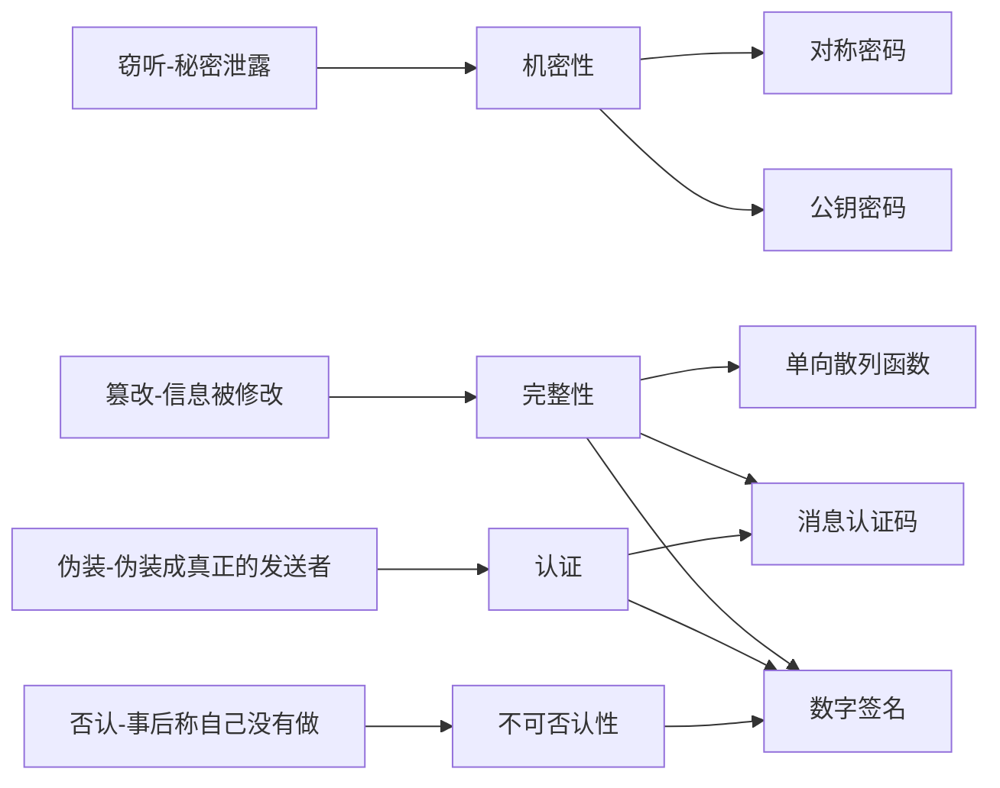

# 1 环游密码世界

发送者sender

接受者receiver

窃听者eavesdropper

加密encrypt

明文plaintext

密文ciphertext

解密decrypt

通过运用密码（cryptography）技术，保证机密性（confidentiality）

密码破译cryptanalysis，或称作**破译**，或称作**密码分析**

破译者cryptanalyst

对称密钥-symmetric cryptography：加密和解密时使用同一密钥的方式，也称作公共密钥密码（common-key cryptography）、传统密码（conventional cryptography）、私钥密码（secret-key cryptography）、共享密钥密码（shared-key cryptography）。

公钥-public key cryptography：加密和解密使用不同密钥的方式。也称为非对称密码（asymmetric cryptography）

将对称密码和公钥密码结合起来的密码方式称为混合密码系统（hybrid cryptosystem）

## 其他密码技术

### 1 单向散列函数

为了防止软件被篡改，有安全意识的软件发布者会在发布软件的同时发布该软件的散列值。散列值就是用单向散列函数（one-way hash function）。

散列值（hash）又称哈希值、密码校验和（cryptographic checksum）、指纹（fingerprint）、消息摘要（message digest）。

单向散列函数并不保证机密性，而是完整性（integrity）。使用单向散列函数，可以检测出数据是否被篡改过。

### 2 消息认证码

为了确认消息是否来自所期望的通信对象，可以使用消息认证码（message authentication code）。此机制不仅能够保证完整性，还能提供认证（authentication）机制。

### 3 数字签名

能够防止伪装、篡改和否认等威胁的技术，就是数字签名（digital signature）。数字签名就是一种将现实世界中的签名和盖章移植到数字世界中的技术，是一种重要的密码技术。数字签名是一种能够确保完整性、提供认证并防止否认的密码技术。

### 4 伪随机数生成器

伪随机数生成器（Pseudo Random Number Generator，PRNG）是一种能够模拟产生随机数列的算法。Web在进行SSL/TLS通信时，会生成一个仅用于当前通信的临时密钥（会话密钥），这个临时密钥就是基于伪随机数生成器生成的。

密码学家的工具箱说法出自，《网络信息安全的真相》（Secrets and Lines: Digital Security in a Networked World）

## 隐写术与数字水印

隐写术（steganography）不是让消息内容变得无法解读，而是能够隐藏消息本身。

密码隐藏的是内容，隐写术隐藏的是消息本身。

## 密码与信息安全常识

- 不要使用保密的密码算法
  - 密码算法的秘密迟早会公诸于世
  - 开发高强度的密码算法是非常困难的
- 使用低强度的密码比不进行任何加密更危险
  - 《密码故事》The Code Book: The History and Exploration
- 任何密码总有一天都会被破解
  - 严格来说，绝对不会被破解的密码算法是存在的，称为一次性密码本（one-time pad），但它并不是一种现实可用的算法。
  - 量子密码，可行的完美的密码技术。
- 密码只是信息安全的一部分
  - 社会工程学（social engineering）攻击。

# 2 历史上的密码

## 2.1 著名的密码

- 凯撒密码
- 简单替换密码
- Enigma